# ARCHON System Architecture Specification

## 1. High-Level System Architecture

```mermaid
graph TD
    User["Developer / Architect"]
    Hero["Landing UI & Mode Switcher<br/>(URL / PR / Local)"]
    API["API Gateway<br/>/api/analyze & /api/repositories/*"]
    
    subgraph Ingestion["Ingestion & Parsing Layer"]
        RepoMgr["RepoManager (simple-git)"]
        JSTsParser["JsTsParser (@babel/parser & traverse)"]
        PyParser["PythonParser (Regex & AST rules)"]
        MdParser["MarkdownParser (Obsidian/Wiki-links)"]
        SecScanner["SecurityScanner (Secret & Vulnerability Audit)"]
    end

    subgraph CoreEngine["Deterministic Graph & Impact Engine"]
        GraphBuilder["GraphBuilder (Symbol & Relationship Assembler)"]
        GraphAlgo["GraphAlgorithms (BFS/DFS, Cycles, Centrality)"]
        ImpactEngine["ImpactEngine (Blast Radius & Cascade Tracer)"]
        IssueDetector["IssueDetector (Bottlenecks, Circular Loops)"]
        HealthCalc["HealthCalculator (A-F Quality Metrics)"]
    end

    subgraph AIContextLayer["Evidence-Grounded AI Layer"]
        ContextBuilder["Context Subgraph Selector"]
        AIProvider["AiProvider (OpenRouter / OpenAI / Anthropic)"]
    end

    subgraph Visualization["Interactive Presentation Layer"]
        Map2D["ArchitectureMap2D (D3 Canvas Force-Directed)"]
        Map3D["ArchitectureMap3D (Three.js WebGL Galaxy)"]
        CanvasView["CodeCanvasView (Interactive Code & File Tree)"]
        Inspector["ComponentInspector & Evidence Drawer"]
        CmdPalette["CommandPalette (Global Cmd+K Index)"]
    end

    User --> Hero
    Hero --> API
    API --> Ingestion
    Ingestion --> CoreEngine
    CoreEngine --> AIContextLayer
    CoreEngine --> Visualization
    AIContextLayer --> Visualization
```

---

## 2. Ingestion & Multi-Language Parsing Pipeline

1. **Sandboxed Acquisition (`RepoManager`)**:
   - Clones target Git repository into isolated temporary workspaces (`data/repos/<id>`).
   - Applies strict depth optimization (`--depth=1`) for fast ingestion.
   - Automatically excludes `.git`, `node_modules`, `dist`, `build`, `.next`, vendor directories, and binary assets.
   - Computes repository SHA, file counts, LOC, and language distribution.

2. **AST Parsing (`JsTsParser`)**:
   - Uses `@babel/parser` with full TypeScript, JSX, and modern ECMAScript plugins.
   - Traverses the AST with `@babel/traverse` to extract:
     - **Functions / Arrow Functions / Methods** with params, return types, line numbers, and docstrings.
     - **Classes & Interfaces** with inheritance (`EXTENDS`) and implementation (`IMPLEMENTS`) links.
     - **API Route Handlers**: Express (`app.get`, `router.post`), Next.js App Router (`GET`, `POST`), FastAPI/Flask, NestJS decorators.
     - **Database Operations**: Prisma (`prisma.user.findMany`), Mongoose/TypeORM (`User.save`), SQL queries (`SELECT`, `INSERT`), Drizzle.
     - **Call Expressions**: Direct function invocations, module cross-references, and event emitters.

3. **Python & Markdown Parsing (`PythonParser` & `MarkdownParser`)**:
   - Extracts Python functions, classes, decorators, Flask/FastAPI routes, and SQLAlchemy / Django ORM models.
   - Parses Markdown documentation and Obsidian wiki-links (`[[Note Name]]`) to map architectural documentation directly onto code symbols.

4. **Security & Vulnerability Scanner (`SecurityScanner`)**:
   - Scans entire repository for exposed API keys (AWS, GitHub, Stripe, OpenAI, Slack, JWT secrets).
   - Detects dangerous code constructs (`eval()`, dynamic SQL concatenation, hardcoded private keys).

---

## 3. Graph Model & Topological Algorithms

### Node Hierarchy & Types
- `repository`
- `service` / `application`
- `module` / `file`
- `class` / `interface`
- `function` / `method`
- `api` / `endpoint`
- `database` / `model`
- `test`

### Typed Relationships (Edges)
- `IMPORTS`: File-level dependency
- `CALLS`: Runtime function or method invocation
- `EXPOSES`: Service exposes API route
- `CONSUMES`: Client / Service fetches API endpoint
- `READS` / `WRITES`: Component queries or persists to Database Model
- `TESTED_BY`: Test file verifies code component
- `EXTENDS` / `IMPLEMENTS`: OOP class inheritance

### Algorithmic Intelligence (`GraphAlgorithms`)
- **Downstream & Upstream Traversal**: BFS exploration mapping all dependent components up to depth $N$.
- **Shortest Path**: Dijkstra/BFS shortest path calculation providing exact step-by-step causal chains.
- **Cycle Detection**: Algorithmic detection of circular dependencies ($A \rightarrow B \rightarrow C \rightarrow A$).
- **Degree Centrality**: Identifies high-centrality architectural bottlenecks and coupling hotspots.

---

## 4. Change Impact & Blast Radius Engine

When any component (function, class, module, API, database) is targeted for Change Impact Analysis:
1. **Direct Impact (Depth 1)**: Immediate callers and consumers with verified source line references.
2. **Indirect Impact (Depth 2+)**: Cascading dependencies across services, background workers, and callers.
3. **API & Service Boundaries**: Highlights exposed HTTP endpoints that could break if this symbol changes.
4. **Database & Persistence**: Surfaces data storage entities potentially corrupted or altered.
5. **Test Coverage & Validation**: Identifies all affected unit/integration tests to execute for regression prevention.

---

## 5. Evidence-Grounded AI Reasoning

- **Context Subgraph Selection**: Rather than dumping thousands of tokens to an LLM, ARCHON extracts the exact $k$-hop subgraph, typed relationships, risk metrics, and relevant source snippets.
- **Prompt Isolation**: Source code is enclosed in strict `<untrusted_code_context>` tags with system instructions to ignore prompt-injection attempts inside user repositories.
- **Provider Fallback**: Seamless multi-provider abstraction supporting OpenRouter, OpenAI, and Anthropic with automatic graceful degradation if no API key is supplied.
